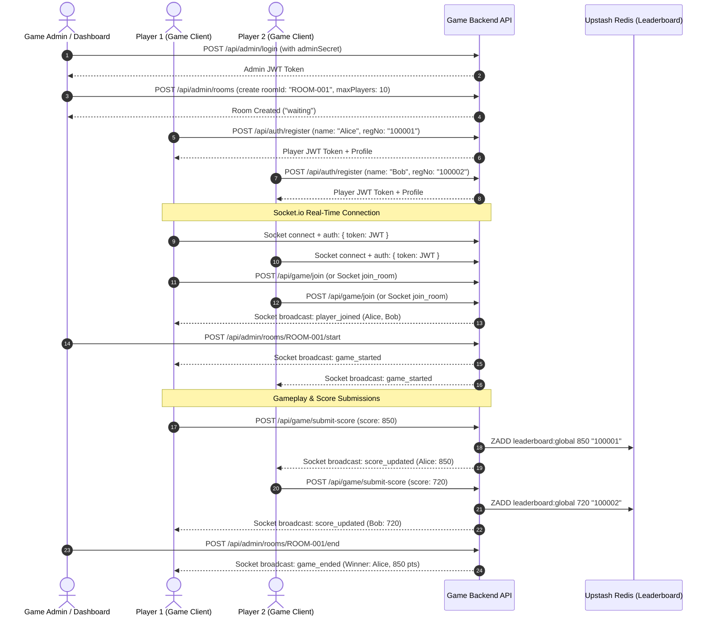

# Multiplayer Game Backend API Documentation & Integration Guide

This document provides complete technical specifications and integration guidelines for the Server-Authoritative Multiplayer Game Backend API. The system handles player registration, real-time room management, server-side score validation, and high-performance global leaderboards.

---

## 1. System Architecture & Workflow

The backend operates on a hybrid REST and WebSocket (Socket.io) architecture:
- **REST API (`/api/*`)**: Handles player authentication, room creation, score submission, and statistical queries.
- **Socket.io WebSocket**: Delivers low-latency, real-time event broadcasting for room state updates, gameplay synchronization, and live scoreboard changes.



---

## 2. Authentication & Request Headers

All authenticated API requests require a JSON Web Token (JWT) transmitted via the standard `Authorization` HTTP header using the `Bearer` scheme:

```http
Authorization: Bearer <jwt_token>
```

- **Player Endpoints (`/api/game/*`, `/api/auth/profile`)**: Require the Player JWT token returned during `POST /api/auth/register`.
- **Admin Endpoints (`/api/admin/*`)**: Require the Admin JWT token returned during `POST /api/admin/login`.

---

## 3. REST API Endpoint Reference

### Player Authentication

#### `POST /api/auth/register`
Registers a new player with a mandatory 6-digit unique registration number. Returns the player profile and a stateless JWT token valid for 7 days.

**Request Body:**
```json
{
  "name": "Alice",
  "registrationNumber": "100001"
}
```

**Response (201 Created):**
```json
{
  "success": true,
  "data": {
    "player": {
      "id": "6a4f7557fd75db09a2c25a31",
      "name": "Alice",
      "registrationNumber": "100001",
      "stats": {
        "totalGames": 0,
        "wins": 0,
        "losses": 0,
        "totalScore": 0,
        "bestScore": 0,
        "avgScore": 0
      }
    },
    "token": "eyJhbGciOiJIUzI1NiIsIn..."
  }
}
```

#### `GET /api/auth/profile`
*(Requires Player Auth)* Retrieves the authenticated player's full profile, registration details, and lifetime statistics.

---

### Game Room & Scoring

#### `POST /api/game/join`
*(Requires Player Auth)* Joins an existing game room. If the player is connected via Socket.io, they are automatically subscribed to the room's real-time events.

**Request Body:**
```json
{
  "roomId": "ROOM-001"
}
```

#### `POST /api/game/submit-score`
*(Requires Player Auth)* Submits the player's current score for an active game room.
*Security Rules: The room must be in the `in_progress` state. The score value must be between 0 and 1,000,000.*

**Request Body:**
```json
{
  "roomId": "ROOM-001",
  "score": 850
}
```

#### `GET /api/game/scoreboard/:roomId`
*(Requires Player Auth)* Retrieves the current real-time scoreboard for the specified room, ordered by score descending.

**Response (200 OK):**
```json
{
  "success": true,
  "data": {
    "scoreboard": [
      {
        "rank": 1,
        "playerId": "6a4f7557fd75db09a2c25a31",
        "name": "Alice",
        "registrationNumber": "100001",
        "score": 850,
        "ready": false
      }
    ]
  }
}
```

---

### Global Leaderboard (Redis Powered)

#### `GET /api/leaderboard?limit=10`
Retrieves the top global players sorted by total score descending. Powered by Upstash Redis Sorted Sets for O(log N) lookup performance.

**Response (200 OK):**
```json
{
  "success": true,
  "data": {
    "leaderboard": [
      {
        "rank": 1,
        "registrationNumber": "100001",
        "score": 850,
        "name": "Alice"
      },
      {
        "rank": 2,
        "registrationNumber": "100002",
        "score": 720,
        "name": "Bob"
      }
    ],
    "total": 2
  }
}
```

#### `GET /api/leaderboard/:registrationNumber`
Retrieves the exact global rank (1-indexed) and score of a specific player by their registration number.

#### `GET /api/leaderboard/:registrationNumber/around?range=5`
Retrieves a slice of the global leaderboard surrounding the specified player (plus/minus `range` positions).

---

### Statistics & Match History

#### `GET /api/stats/:registrationNumber`
Retrieves lifetime performance metrics (`totalGames`, `wins`, `losses`, `bestScore`, `avgScore`) for any player.

#### `GET /api/matches/:registrationNumber`
Retrieves paginated historical match records involving the specified player.

---

### Admin Management

#### `POST /api/admin/login`
Authenticates an administrator using the configured `ADMIN_SECRET` environment variable.

**Request Body:**
```json
{
  "adminSecret": "your_admin_secret"
}
```

#### `POST /api/admin/rooms`
*(Requires Admin Auth)* Creates a new game room with a customizable maximum player capacity.

**Request Body:**
```json
{
  "roomId": "ROOM-001",
  "name": "Battle Arena",
  "maxPlayers": 10
}
```

#### `POST /api/admin/rooms/:roomId/start`
*(Requires Admin Auth)* Transitions the room status from `waiting` to `in_progress`. Broadcasts `game_started` to all connected clients in the room.

#### `POST /api/admin/rooms/:roomId/end`
*(Requires Admin Auth)* Concludes the game (`status` becomes `ended`), calculates the winner, records historical match data into MongoDB, and updates lifetime win/loss stats for all participants.

#### `DELETE /api/admin/data/reset`
*(Requires Admin Auth)* Clears all active in-memory rooms, deletes all player and match documents in MongoDB, and flushes the Upstash Redis leaderboard. Intended for development and testing environments.

---

## 4. Socket.io Real-Time Events Reference

Connect your game engine to the WebSocket server using the player's JWT token:

```javascript
import { io } from "socket.io-client";

const socket = io("http://localhost:3000", {
  auth: {
    token: "<player_jwt_token>"
  }
});

socket.on("connect", () => {
  console.log("WebSocket connection established.");
});
```

### Client-to-Server Events (`socket.emit`)
| Event Name | Payload Example | Description |
| :--- | :--- | :--- |
| `join_room` | `{ "roomId": "ROOM-001" }` | Subscribes the socket to the specified room channel. |
| `leave_room` | `{ "roomId": "ROOM-001" }` | Unsubscribes the socket from the room channel. |
| `player_ready` | `{ "roomId": "ROOM-001", "ready": true }` | Updates the player's lobby readiness state. |
| `submit_action` | `{ "roomId": "ROOM-001", "actionType": "MOVE", "payload": {...} }` | Transmits custom gameplay events directly to other players in the room. |

### Server-to-Client Events (`socket.on`)
| Event Name | Payload Example | Description |
| :--- | :--- | :--- |
| `room_state` | `{ room: {...} }` | Sent immediately after joining a room with the complete room state. |
| `player_joined` | `{ playerId, name, regNo, playerCount }` | Broadcast to the room when a new participant joins. |
| `player_left` | `{ playerId, name, regNo, playerCount }` | Broadcast to the room when a participant disconnects or leaves. |
| `game_started` | `{ roomId, startedAt }` | Broadcast when the administrator initiates the match. |
| `score_updated` | `{ playerId, score, scoreboard: [...] }` | Broadcast when any player submits a verified score update. |
| `game_ended` | `{ roomId, results: { winner, scoreboard } }` | Broadcast when the match concludes, containing the winner and final standings. |
| `error` | `{ message: "Room is currently full." }` | Sent to the emitting socket if an action violates game rules or validation limits. |

---

## 5. Client Integration Example (JavaScript / Web / Node.js)

The following `GameBackendClient` class provides a clean, self-contained reference implementation that game developers can integrate into their project:

```javascript
import { io } from "socket.io-client";

export class GameBackendClient {
  constructor(baseUrl = "http://localhost:3000") {
    this.baseUrl = baseUrl;
    this.token = null;
    this.player = null;
    this.socket = null;
  }

  // Register and authenticate with a 6-digit registration number
  async register(name, registrationNumber) {
    const response = await fetch(`${this.baseUrl}/api/auth/register`, {
      method: "POST",
      headers: { "Content-Type": "application/json" },
      body: JSON.stringify({ name, registrationNumber })
    });
    const result = await response.json();
    if (!result.success) throw new Error(result.error.message);
    
    this.token = result.data.token;
    this.player = result.data.player;
    this.connectSocket();
    return this.player;
  }

  // Connect Socket.io for real-time room communication
  connectSocket() {
    this.socket = io(this.baseUrl, { auth: { token: this.token } });
    
    this.socket.on("game_started", (data) => {
      console.log("Game Started:", data);
      // Initiate local game engine loop
    });

    this.socket.on("score_updated", (data) => {
      console.log("Score Updated:", data.scoreboard);
      // Update in-game scoreboard UI
    });

    this.socket.on("game_ended", (data) => {
      console.log("Game Concluded. Winner:", data.results.winner);
      // Display post-match summary screen
    });
  }

  // Join a game room via both REST and Socket channels
  async joinRoom(roomId) {
    await fetch(`${this.baseUrl}/api/game/join`, {
      method: "POST",
      headers: { 
        "Content-Type": "application/json",
        "Authorization": `Bearer ${this.token}`
      },
      body: JSON.stringify({ roomId })
    });
    this.socket.emit("join_room", { roomId });
  }

  // Submit gameplay score
  async submitScore(roomId, score) {
    const response = await fetch(`${this.baseUrl}/api/game/submit-score`, {
      method: "POST",
      headers: { 
        "Content-Type": "application/json",
        "Authorization": `Bearer ${this.token}`
      },
      body: JSON.stringify({ roomId, score })
    });
    return await response.json();
  }

  // Query global top 10 leaderboard
  async getGlobalLeaderboard() {
    const response = await fetch(`${this.baseUrl}/api/leaderboard?limit=10`);
    const result = await response.json();
    return result.data.leaderboard;
  }
}
```
