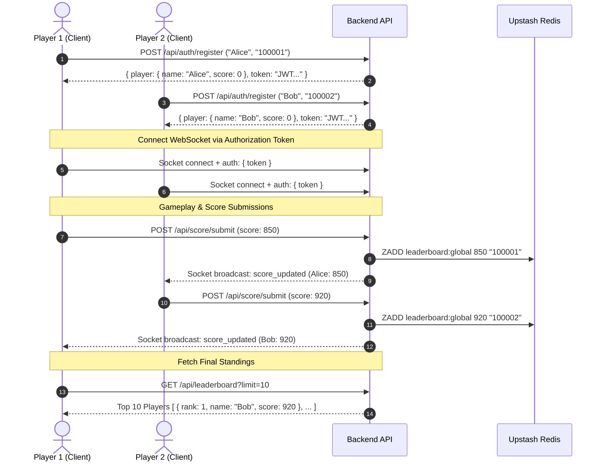

# Single-Instance Multiplayer Game Scoring Backend API Documentation & Integration Guide

This document provides complete technical specifications and integration guidelines for the streamlined single-instance scoring and leaderboard backend.

---

## 1. System Architecture & Workflow

The backend operates on a hybrid REST and WebSocket (`Socket.io`) architecture tailored for quick game sessions:
- **REST API (`/api/*`)**: Handles frictionless entry, score updates, and live Top 10 queries.
- **Socket.io WebSocket**: Emits live `score_updated` and `data_reset` events across all connected clients.



---

## 2. REST API Endpoint Reference

### Player Entry (`POST /api/auth/register`)
Accepts `{ name, registrationNumber }`. If the 6-digit registration number is new, it registers them (`201 Created`). If already registered, it logs them back in seamlessly (`200 OK`) and returns their existing score and JWT token. No duplicate conflict errors.

**Request Body:**
```json
{
  "name": "Alice",
  "registrationNumber": "100001"
}
```

**Response (`201 Created` or `200 OK`):**
```json
{
  "success": true,
  "data": {
    "token": "eyJhbGciOiJIUzI1NiIsIn...",
    "player": {
      "id": "6a4f7557fd75db09a2c25a31",
      "name": "Alice",
      "registrationNumber": "100001",
      "score": 0
    }
  }
}
```

---

### Score Submission (`POST /api/score/submit` & `/api/game/submit-score`)
*(Requires Header: `Authorization: Bearer <token>`)* Submits or updates the player's score. Updates both MongoDB (`Player.score`) and Upstash Redis (`leaderboard:global`), and broadcasts `score_updated` via Socket.io.

**Request Body:**
```json
{
  "score": 850
}
```

**Response (`200 OK`):**
```json
{
  "success": true,
  "data": {
    "player": {
      "id": "6a4f7557fd75db09a2c25a31",
      "name": "Alice",
      "registrationNumber": "100001",
      "score": 850
    }
  }
}
```

---

### Top 10 Leaderboard (`GET /api/leaderboard?limit=10`)
Returns the global top players sorted descending by `score` in $O(\log N)$ lookup time via Upstash Redis.

**Response (`200 OK`):**
```json
{
  "success": true,
  "data": {
    "leaderboard": [
      {
        "rank": 1,
        "registrationNumber": "100002",
        "score": 920,
        "name": "Bob"
      },
      {
        "rank": 2,
        "registrationNumber": "100001",
        "score": 850,
        "name": "Alice"
      }
    ],
    "total": 2
  }
}
```

---

### Direct Reset Endpoint (`DELETE /api/reset`)
Wipes all player documents from MongoDB and clears the Upstash Redis leaderboard. No admin login or secret required.

**Response (`200 OK`):**
```json
{
  "success": true,
  "data": {
    "message": "All game data and leaderboards have been reset successfully.",
    "deletedPlayers": 2,
    "leaderboardReset": true
  }
}
```

---

## 3. Client Integration Example (JavaScript / Web / Node.js)

```javascript
import { io } from "socket.io-client";

export class GameBackendClient {
  constructor(baseUrl = "http://localhost:3000") {
    this.baseUrl = baseUrl;
    this.token = null;
    this.player = null;
    this.socket = null;
  }

  // 1. Enter game (register or returning login)
  async enterGame(name, registrationNumber) {
    const response = await fetch(`${this.baseUrl}/api/auth/register`, {
      method: "POST",
      headers: { "Content-Type": "application/json" },
      body: JSON.stringify({ name, registrationNumber })
    });
    const result = await response.json();
    if (!result.success) throw new Error(result.error.message);
    
    this.token = result.data.token;
    this.player = result.data.player;
    this.connectSocket();
    return this.player;
  }

  // 2. Connect real-time socket
  connectSocket() {
    this.socket = io(this.baseUrl, { auth: { token: this.token } });
    
    this.socket.on("score_updated", (data) => {
      console.log("Player Score Updated:", data);
      if (data.leaderboard) {
        console.log("New Top 10 Leaderboard:", data.leaderboard);
      }
    });

    this.socket.on("leaderboard_updated", (data) => {
      console.log("Live Top 10 Leaderboard Standings:", data.leaderboard);
      // Update local UI / Projector screen
    });

    this.socket.on("data_reset", () => {
      console.log("All game data was reset by server.");
    });
  }

  // 3. Submit score
  async submitScore(score) {
    const response = await fetch(`${this.baseUrl}/api/score/submit`, {
      method: "POST",
      headers: { 
        "Content-Type": "application/json",
        "Authorization": `Bearer ${this.token}`
      },
      body: JSON.stringify({ score })
    });
    return await response.json();
  }

  // 4. Fetch Top 10 Leaderboard
  async getTop10Leaderboard() {
    const response = await fetch(`${this.baseUrl}/api/leaderboard?limit=10`);
    const result = await response.json();
    return result.data.leaderboard;
  }

  // 5. Reset all server data
  async resetAllData() {
    const response = await fetch(`${this.baseUrl}/api/reset`, { method: "DELETE" });
    return await response.json();
  }
}
```
